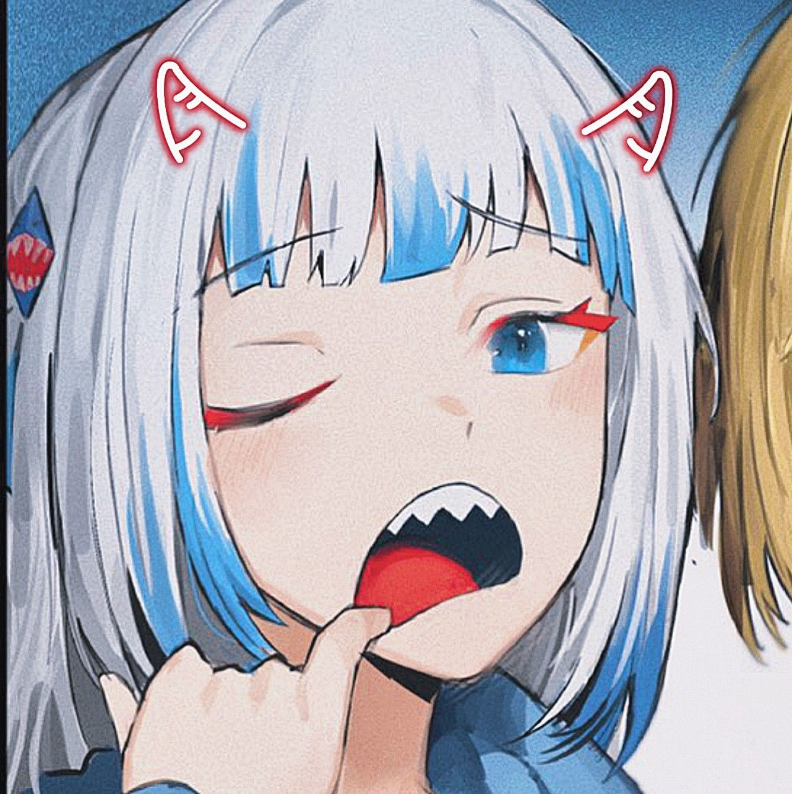
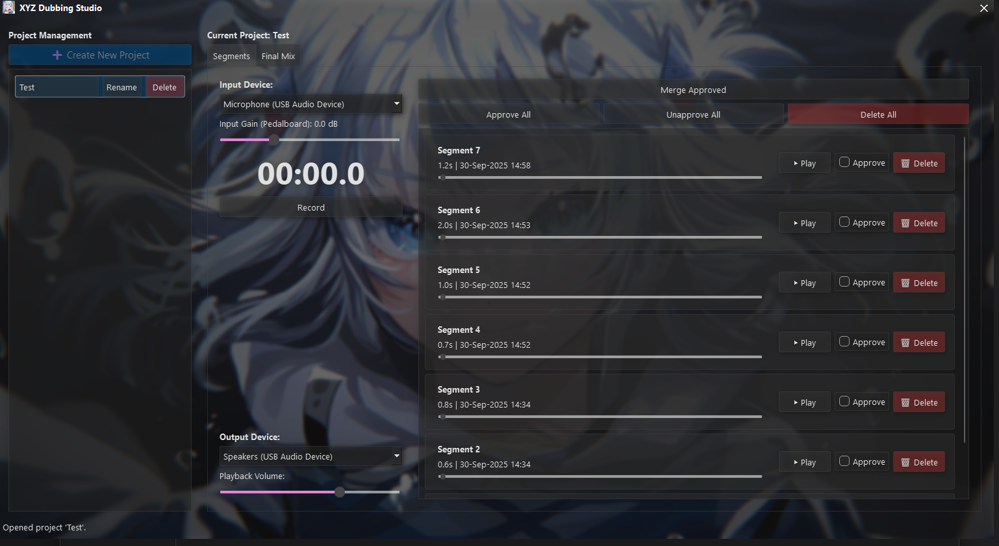

#  XYZ Dubbing Studio

> A streamlined, professional-grade dubbing and voice-over tool for content creators.

XYZ Dubbing Studio is a flagship application from the **XYZ Project**, my self project to doing anything more efficient. It is provided as a standalone, portable `.exe` that requires no installation.

  

## Core Features

*   **Professional Glass Pane UI:** A beautiful, modern interface that floats on your desktop.
*   **Non-Destructive Workflow:** Record clean, raw audio segments. Review and approve the best takes without ever altering the original recordings.
*   **Simple Project Management:** Organize your work into separate, self-contained project folders.
*   **One-Click Versioned Merging:** Combine all your approved takes into a new, versioned `Final Mix #.wav` file with a single click. The original segments remain untouched.
*   **Standalone & Portable:** A single executable file that runs on any modern Windows machine. No installation needed.

## How to Use

The workflow is designed to be simple and intuitive for a fast turnaround:

1.  **Create a Project:** Launch the application and click `➕ Create New Project`. Give your project a name (e.g., "Episode 1 VO").
2.  **Record Segments:** Once a project is open, select your microphone and press the `Record` button (or the `R` hotkey) to start recording a take. Press `Stop` when finished.
3.  **Review & Approve:** Your new segment will appear at the top of the list. Play it back, and if you're happy with it, check the `Approve` box. Record as many takes as you need.
4.  **Merge Your Takes:** Once you have approved all the segments you want in your final audio, click the `Merge Approved` button.
5.  **Find Your Final Mix:** The application will automatically switch to the "Final Mix" tab, where you will find your newly created, versioned audio file (e.g., `Final Mix 1.wav`), ready for use in your video editor.

### Where Your Files Are Stored

All your projects, recorded segments, final mixes, and the application's log file are stored securely and automatically in a dedicated folder within your user's Documents directory:
`Your Documents Folder\XYZ Project\XYZ Dubbing Studio\`

---

### XYZ